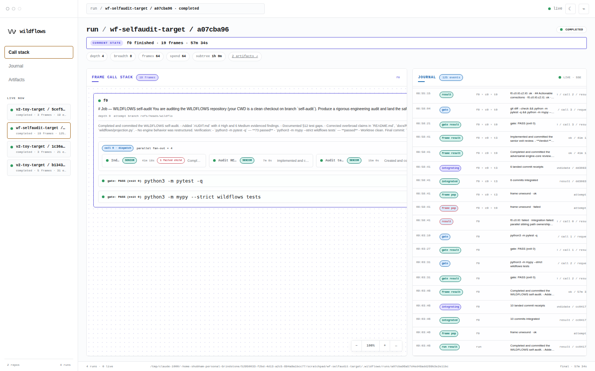
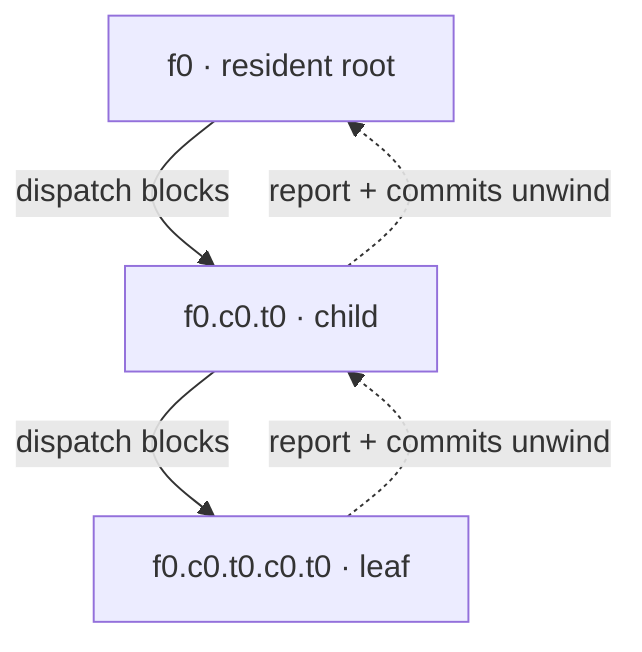
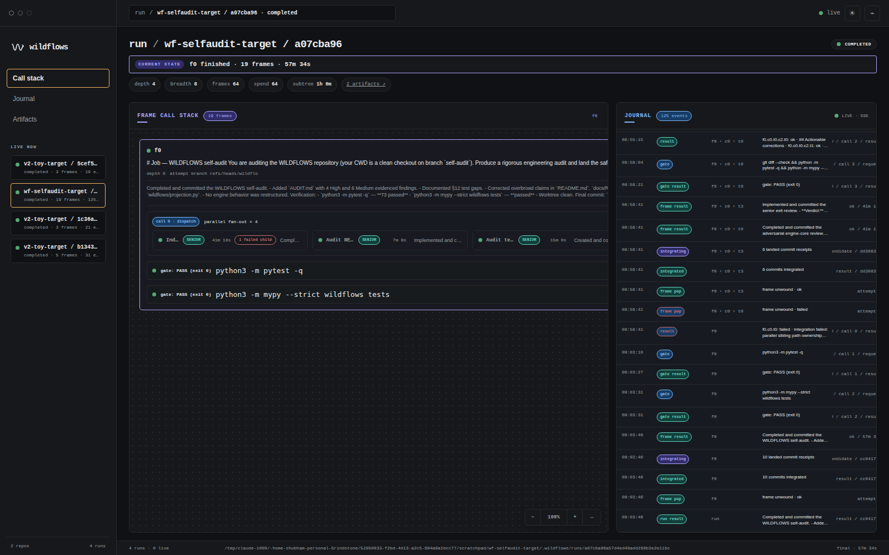

# WILDFLOWS

**A durable call stack for resident agents: tool calls become banked work, branches stack with frames, and replay never pays twice.**



## What is this?

WILDFLOWS is a standalone supervisor for long-running agent work. A run is a call
stack of resident agent **frames**: each frame keeps its context and works on its own
Git branch and external worktree. When it makes a blocking tool call, that call *is the
bank*—the caller stays alive while the engine does the durable work below it. The MCP
tool surface has only three tools, exposed by the reference Pi shim with
`wildflows_`-prefixed names:

- **`wildflows_dispatch(tasks?, rig?, parallel?, skills?, kinds?, retry_frame?)`**
  (`dispatch` over MCP) pushes child frames, then returns their reports and integrated
  commits. `rig` is either one name for every task or a parallel array; omission and
  null array entries inherit the caller's rig. `kinds` is an optional journalled
  semantic label per task and has no routing power. A failed result carries its branch/head/diffstat, and
  `retry_frame` alone relaunches that failed direct child on the same branch;
- **`wildflows_gate(cmd)`** (`gate`) runs a deterministic check in the caller's
  worktree and returns the exit code plus complete stdout and stderr;
- **`wildflows_ask(question)`** (`ask`) parks the frame until the owner answers.

Sequences, loops, synthesis, and retry policy remain ordinary agent control flow. The
engine owns effects: admission, journals, worktrees, branch integration, and replay.



A child starts from its caller's frame branch—not from the run branch. Child commits
integrate upward on return; the run branch moves once, when `f0` unwinds. Dispatch is
serial by default, so each task integrates before the next starts; with `parallel: true`,
siblings share a starting tip and integrate only disjoint path ownership.

## Quickstart

WILDFLOWS requires Python 3.12+ and a clean Git target. The reference resident adapter
uses an authenticated [`pi`](https://github.com/badlogic/pi-mono) installation.

```bash
pip install -e .
# Add the optional dashboard dependencies:
pip install -e '.[dash]'

cat > job.md <<'EOF'
# Job
Inspect the target, implement the requested change, delegate bounded work where useful,
and verify the result with wildflows_gate. Commit useful work before every tool call.
EOF

cat > rigs.yaml <<'EOF'
# Optional owner wakeup after a frame asks:
# notify: /path/to/owner-notify
# Optional repository-wide provisioning for every fresh frame checkout:
worktree:
  setup: python3 -m project_bootstrap --worktree
  link: [.cache/dependencies]
rigs:
  senior:
    kind: script
    description: deep architecture and review lane
    script: rigs/worker-picodex.sh
    log_dir: /tmp/wildflows/senior
    timeout_s: 1800
    gate_timeout_s: 7200
  worker:
    kind: script
    description: bounded implementation lane
    script: rigs/worker-local.sh
    log_dir: /tmp/wildflows/worker
    timeout_s: 900
    slots: 2
EOF

python3 -m wildflows run job.md \
  --repo /path/to/clean-git-target --rigs rigs.yaml --root-rig senior
```

The CLI prints the run id. A top-level `notify` requests a best-effort wakeup after each
new owner question; the command receives the question, frame id, and run id, and
`--notify` overrides it. Replay a stopped stack with the same job and registry:

```bash
python3 -m wildflows resume job.md \
  --repo /path/to/clean-git-target --rigs rigs.yaml --root-rig senior \
  --run-id <id>
```

Answer a pending `ask` in the dashboard with its startup control token, or add
`--answer TEXT` to `resume` (`--answer-frame` and `--answer-call` disambiguate).

For a small two-leaf example, see [`examples/toy-run`](examples/toy-run/).


## The journal is the stack

The durable frame/call history is an append-only stream of fsynced v2 records at
`<target>/.wildflows/runs/<run-id>/events.ndjson`. The current event kinds are
`run_opened`, `frame_pushed`, `frame_slot_queued`, `frame_slot_acquired`,
`frame_slot_released`, `worktree_provisioned`, `dispatch_called`, `dispatch_returned`, `gate_called`,
`gate_returned`, `asked`, `answered`, `call_refused`, `call_failed`, `worker_reaped`,
`frame_relaunch_blocked`, `frame_commit_warning`, `frame_exited`, `frame_integrating`,
`frame_integrated`, `frame_popped`, `run_interrupted`, and `run_finished`.
`frame_relaunch_blocked` parks replay when a live frame branch has
advanced beyond the journal-explained tip. Frame ids are structural breadcrumbs. This
is the opening of the committed dashboard fixture, rendered in the same breadcrumb
style as the console:

```text
seq  frame / call                         event
0    run                                  run_opened
1    f0                                   frame_pushed
2    f0 / call 0                          dispatch_called
3    f0 › c0 › t0                         frame_pushed
4    f0 › c0 › t0 / call 0                dispatch_called
5    f0 › c0 › t0 › c0 › t0              frame_pushed
```

The source records are
[`examples/dashboard-fixture/.wildflows/runs/frame-stack-demo/events.ndjson`](examples/dashboard-fixture/.wildflows/runs/frame-stack-demo/events.ndjson).
On resume, frames restart from their original prompts plus a digest of completed and
pending calls. A repeated call with the same frame, logical index, and canonical content
hash returns its journalled result instead of launching or gating twice.

## Skills are layered data

A dispatch can assign one ordered skill-name list to each task. WILDFLOWS ships five
Markdown bundles; target-local `.wildflows/skills/*.md` files add skills or shadow a
bundled file with the same stem. The root receives `dispatch-economy` and
`orchestration-shapes` by default; parents route that pair to children expected to
further dispatch. Skills steer prompts—they do not grant capability or change admission.

Every frame receives its assigned skill texts in order, then its job, then one engine
`RESOURCES` preamble. That block gives the currently dispatchable rig registry keys and
operator descriptions, effective depth/width/frame/spend limits, the resolved skill
manifest, and tool/refusal/replay guidance. Rig keys—not adapter script filenames—are
passed to dispatch. A skill starts with `# title — one-line description`; no plugin code
or frontmatter is involved.

## Dashboard

```bash
python3 -m wildflows dash --repo /path/to/clean-git-target
# http://127.0.0.1:8181
```

Port **8181** is the default (`--port` overrides it). The local FastAPI/Uvicorn server
tails complete journal records over SSE; the static console renders running leaves,
banked callers, auto-collapsed completed frames, queued fan-out, gates, failures,
interrupted runs, and parked asks on a pannable, two-axis canvas with pointer-centered
zoom and fit-to-width.
Frame color follows its own exit; failed direct children become count chips instead of
repainting a successful parent. The only mutation is a token-guarded answer to a pending
owner question.

| Light | Dark |
|---|---|
|  |  |

The pair above is the real 19-frame WILDFLOWS self-audit in both themes, including its
four-worker audit dispatch, one failed descendant, and final pytest and mypy gates.

## Dogfood and reference

The [design ledger](docs/DESIGN.md#evidence) records the owner-run results:

- **DF1:** the resident-frame pivot fixed a real React Native clipping family in
  **20m40s**; the predecessor spent roughly five hours and did not close it.
- **DF2:** a 36-asset quality swarm ran live dogfood of the parallel frame path.
- [`docs/DESIGN.md` §12](docs/DESIGN.md#12-v2--the-frame-architecture-call-stack-pivot-2026-07-14) — decision ledger and durability model
- [`docs/RIGS.md`](docs/RIGS.md) — YAML registry and process/environment contract
- [`docs/DASHBOARD.md`](docs/DASHBOARD.md) — watchlists, deep links, fixture, and answer seam

Install `pip install -e '.[dev]'`, then develop with `python3 -m pytest -q`,
`python3 -m mypy --strict wildflows tests`, and `bash -n rigs/*.sh`. Tests use fake
agent binaries; they do not invoke models.

MIT © 2026 Shubham Yadav. See [`LICENSE`](LICENSE).
