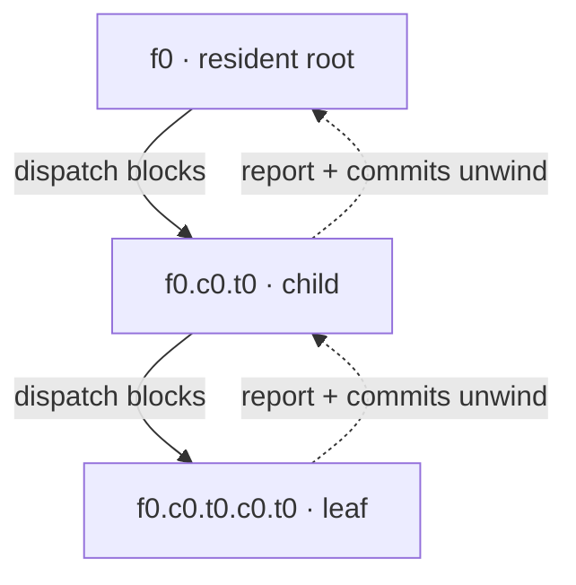
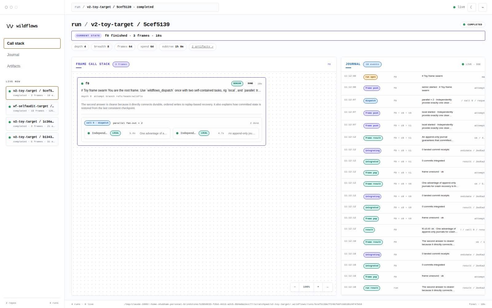

# WILDFLOWS

**A durable call stack for resident agents: tool calls become banked work, branches stack with frames, and replay never pays twice.**


## What is this?

WILDFLOWS is a standalone supervisor for long-running agent work. A run is a call
stack of resident agent **frames**: each frame keeps its context and works on its own
Git branch and external worktree. When it makes a blocking tool call, that call *is the
bank*—the caller stays alive while the engine does the durable work below it. There are
only three engine tools:

- **`dispatch(tasks, rig, parallel?, skills?)`** pushes child frames, then returns their
  reports and integrated commits;
- **`gate(cmd)`** runs a deterministic check in the caller's worktree and returns the
  exit code plus complete stdout and stderr;
- **`ask(question)`** parks the frame until the owner answers.

Sequences, loops, synthesis, and retry policy remain ordinary agent control flow. The
engine owns effects: admission, journals, worktrees, branch integration, and replay.



A child starts from its caller's frame branch—not from the run branch. Child commits
integrate upward on return; the run branch moves once, when `f0` unwinds. Parallel
siblings share a starting tip and integrate only disjoint path ownership.

## Quickstart

WILDFLOWS requires Python 3.12+ and a clean Git target. The reference resident adapter
uses an authenticated [`pi`](https://github.com/badlogic/pi-mono) installation.

```bash
pip install -e .
# Add the optional dashboard dependencies:
pip install -e '.[dash]'

cat > job.md <<'EOF'
# Job
Inspect the target, implement the requested change, delegate bounded work where useful,
and verify the result with wildflows_gate. Commit useful work before every tool call.
EOF

cat > rigs.yaml <<'EOF'
rigs:
  senior:
    kind: script
    script: rigs/worker-picodex.sh
    log_dir: /tmp/wildflows/senior
    timeout_s: 1800
  worker:
    kind: script
    script: rigs/worker-picodex.sh
    log_dir: /tmp/wildflows/worker
    timeout_s: 900
EOF

python3 -m wildflows run job.md \
  --repo /path/to/clean-git-target --rigs rigs.yaml --root-rig senior
```

The CLI prints the run id. Replay a stopped stack with the same job and registry:

```bash
python3 -m wildflows resume job.md \
  --repo /path/to/clean-git-target --rigs rigs.yaml --root-rig senior \
  --run-id <id>
```

For a small two-leaf example, see [`examples/toy-run`](examples/toy-run/).



## The journal is the stack

Every effect is an fsynced v2 record at
`<target>/.wildflows/runs/<run-id>/events.ndjson`. Frame ids are structural
breadcrumbs. This is the opening of the committed dashboard fixture, rendered in the
same breadcrumb style as the console:

```text
seq  frame / call                         event
0    run                                  run_opened
1    f0                                   frame_pushed
2    f0 / call 0                          dispatch_called
3    f0 › c0 › t0                         frame_pushed
4    f0 › c0 › t0 / call 0                dispatch_called
5    f0 › c0 › t0 › c0 › t0              frame_pushed
```

The source records are
[`examples/dashboard-fixture/.wildflows/runs/frame-stack-demo/events.ndjson`](examples/dashboard-fixture/.wildflows/runs/frame-stack-demo/events.ndjson).
On resume, frames restart from their original prompts plus a digest of completed and
pending calls. A repeated call with the same frame, logical index, and canonical content
hash returns its journalled result instead of launching or gating twice.

## Skills are layered data

A dispatch can assign one ordered skill-name list to each task. WILDFLOWS ships three
Markdown bundles; target-local `.wildflows/skills/*.md` files add skills or shadow a
bundled file with the same stem. Skills steer prompts—they do not grant capability or
change admission.

Every frame receives its assigned skill texts in order, then its job, the resolved skill
manifest, and finally the engine tool/replay preamble. A skill starts with
`# title — one-line description`; no plugin code or frontmatter is involved.

## Dashboard

```bash
python3 -m wildflows dash --repo /path/to/clean-git-target
# http://127.0.0.1:8181
```

Port **8181** is the default (`--port` overrides it). The local FastAPI/Uvicorn server
tails complete journal records over SSE; the static console renders running leaves,
banked callers, collapsed dispatches, queued fan-out, gates, failures, and parked asks.
The only mutation is a token-guarded answer to a pending owner question.

| Light | Dark |
|---|---|
|  |  |

The hero is the live DF2 asset-quality swarm. The pair above is the tracked synthetic
fixture: 20-way fan-out, a ghost queue, a parked ask, a failed gate, and depth-four
drill-in.

## Receipts and reference

- **DF1:** the resident-frame pivot fixed a real React Native clipping family in
  **20m40s**; the predecessor spent roughly five hours and did not close it.
- **DF2:** the asset-quality swarm shown above is live dogfood of the parallel frame
  path.
- [`docs/DESIGN.md` §12](docs/DESIGN.md#12-v2--the-frame-architecture-call-stack-pivot-2026-07-14) — decision ledger and durability model
- [`docs/RIGS.md`](docs/RIGS.md) — YAML registry and process/environment contract
- [`docs/DASHBOARD.md`](docs/DASHBOARD.md) — watchlists, deep links, fixture, and answer seam

Develop with `python3 -m pytest -q`, `python3 -m mypy --strict wildflows tests`, and
`bash -n rigs/*.sh`. Tests use fake agent binaries; they do not invoke models.

MIT © 2026 Shubham Yadav. See [`LICENSE`](LICENSE).
